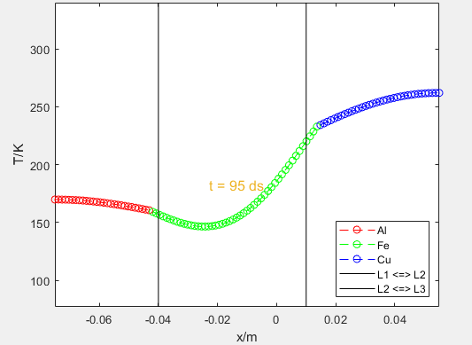

# Heat Equation

## Description

The Heat Equation Simulation is a `MATLAB` script that models the **1D heat equation for metal bars** made of `aluminum` (*Al*), `iron` (*Fe*), and `copper` (*Cu*). It discretizes space and time to ensure stability and assumes ***Neumann boundary conditions***. The simulation calculates the temperature distribution over time for the metal bars, visualizing the evolution of temperature profiles.

    <video controls width="49%">
        <source src="images/heat_equation_sym.mp4" type="video/mp4">
        IT DOESN'T SUPPORT MP4 FORMAT!!!
    </video>
    

## Intended Use Cases

- **Educational Use:** Enables students to understand heat equation principles via interactive simulation, enhancing learning in physics education.
- **Engineering Application:** Assists engineers in analyzing heat distribution, aiding design optimization in thermal engineering projects.

## Physical Parameters

- **Characteristics Time:** Determines the characteristic time for the system based on the metal bars properties.
- **Initial Conditions:** Specifies the initial temperatures for each metal bar.
- **Diffusion Coefficient:** Sets the diffusion coefficient based on the material type.

## Dynamic Process

- **Temperature Calculation:** Calculates the temperature distribution over time using the heat equation and finite difference method.
- **Boundary Conditions:** Applies Neumann boundary conditions to the simulation.
- **Dynamic Visualization:** Dynamically visualizes the temperature distribution over time using a graphical simulation.

## Numerical Solution

To solve the heat equation numerically, the finite difference method is employed. This method discretizes both space and time, allowing us to approximate the continuous heat equation using discrete values.

**$$
\frac{\partial T}{\partial t} = D \frac{\partial^2 T}{\partial x^2}
$$**

- where **$T$** is the temperature,
- **$D$** is the thermal diffusivity,
- **$t$** is time, and
- **$x$** is position along the metal bar.

The temperature distribution over time is then calculated using a numerical scheme that approximates the heat equation. This scheme typically involves updating the temperature values at each point in space and time based on the neighboring temperature values and the thermal diffusivity of the material.

**$$
T_{i+1,j} = T_{i,j} + \frac{{\Delta t}}{{\Delta x^2}} \left( D_{j+1}(T_{i,j+1} - T_{i,j}) - D_{j}(T_{i,j} - T_{i,j-1}) \right)
$$**

- where **$T_{i,j}$** is the temperature at time **$i$** and position **$j$**,
- **$D_{j}$** is the thermal diffusivity at position **$j$**,
- **$Delta$** t is the time step, and
- **$Delta$** x is the spatial step.

## Neumann Boundary Conditions

The **Neumann boundary conditions** at both ends of the metal bars ensures that the heat flux, or the rate of heat transfer per unit area, is controlled at these boundaries:
**$$\frac{{\partial T}}{{\partial x}} = 0$$**

*At both ends of the metal bars*, **Neumann boundary conditions** *are enforced*. These conditions dictate the heat flux at the boundaries rather than directly setting the temperature. Instead of directly prescribing the temperature values, these conditions govern how heat is allowed to flow into or out of the system through the boundaries.

**$$
\frac{{T_{i+1,1} - T_{i,1}}}{{\Delta x}} = 0 \implies T_{i+1,1} = T_{i,1}
$$**

**$$
\frac{{T_{i+1,P} - T_{i,P}}}{{\Delta x}} = 0 \implies T_{i+1,P} = T_{i,P}
$$**

By specifying the heat flux at the boundaries, we effectively regulate the transfer of thermal energy across them. This approach is particularly useful when modeling scenarios where the physical boundaries are insulated or when the rate of **heat transfer is of primary interest**.
